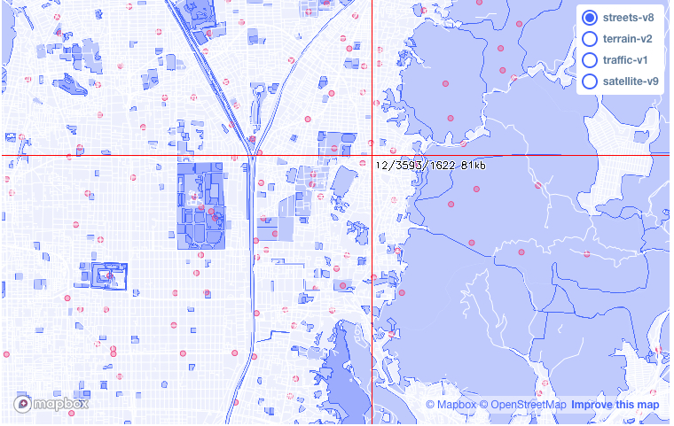
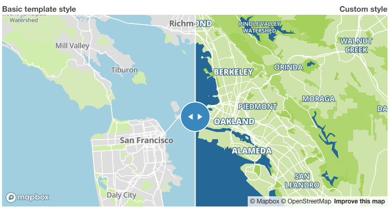
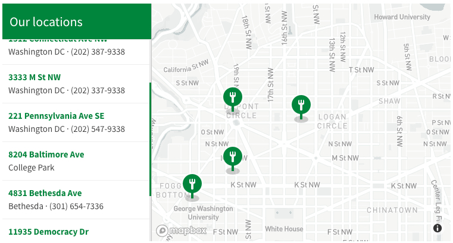
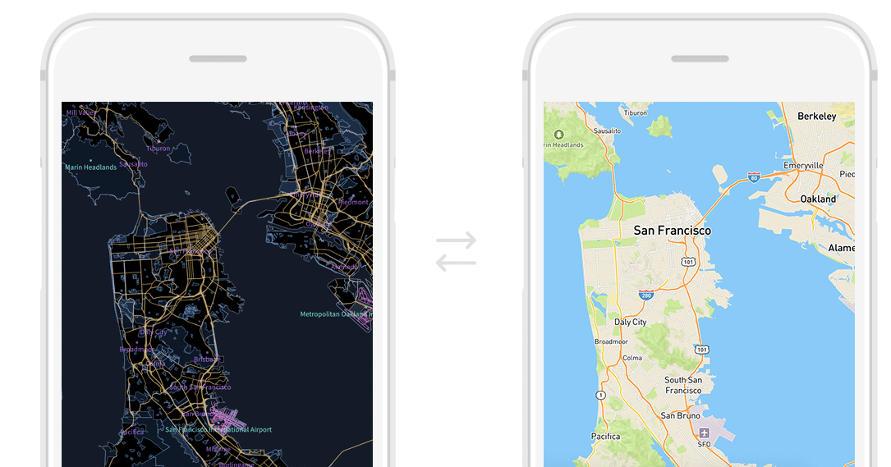
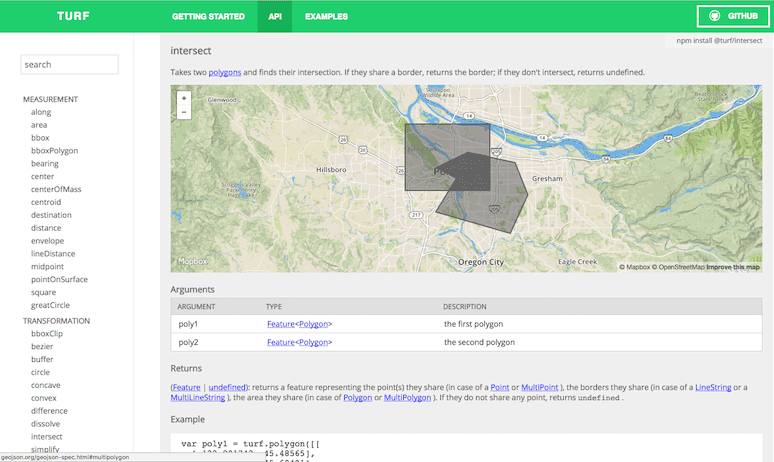
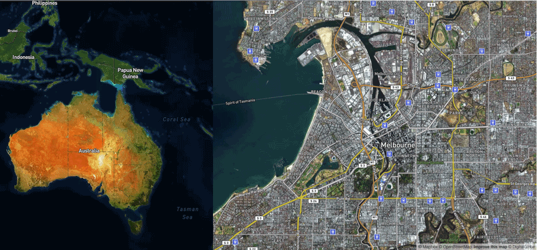
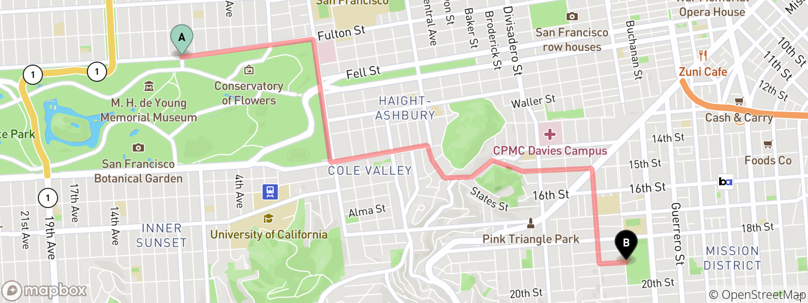

# 概览

**翻译**：穆仁武 **校对**：王涌权 [原文](https://docs.mapbox.com/help/how-mapbox-works/)

欢迎来到 Mapbox！Mapbox 是一个跨行业的开发平台，用于创建自定义应用程序，解决地图、数据和空间分析问题。Mapbox 的工具集是模块化的，用以支持 Web 和移动地图开发制作过程的每个环节。无论您的目标是创建一个精美的地图来适配您的网站，还是建立一个功能齐全的地理信息处理应用，我们都为您提供帮助。

本指南将向您介绍 Mapbox 的模块并教会您：

* 使用 Mapbox 的 **robust data**。
* **style** 定义你的地图到非常细节的程度。
* **上传**或**创建**自定义数据。
* **开发**功能完备的 web 和移动端应用。
* **扩展**你的 app 的功能性, 使用[地理编码](http://www.mapbox.cn/help/glossary/geocoding/)、路径分析、空间分析等的 web 服务。
* 以编程方式**创建**静态地图。

## [使用 Mapbox 地图数据](http://www.mapbox.cn/help/how-mapbox-works/#%E4%BD%BF%E7%94%A8-mapbox-%E5%9C%B0%E5%9B%BE%E6%95%B0%E6%8D%AE)

我们的核心 [tilesets](http://www.mapbox.cn/help/glossary/tileset/)：Mapbox 街道、Mapbox 地形、Mapbox 交通和 Mapbox 卫星。每一个 tileset 包含各自独一无二的数据集，其来源于多种多样的数据源。

* **Mapbox 街道**包括基于 [OpenStreetMap](http://www.openstreetmap.org/) 数据源的街道、建筑物，行政区域，水域和陆地资料，每五分钟更新一次。
* **Mapbox 地形**包括陆地覆盖物资料和全球高程数据集，配有轮廓线、山体阴影和高程数据。
* **Mapbox 卫星**包括[各种来源的](https://www.mapbox.com/about/maps)全球卫星图像，由 Mapbox 处理和缝合。
* **Mapbox 交通**包括 Mapbox 街道上定期更新的车辆拥堵信息。

您可以在我们的[矢量瓦片图概览](https://www.mapbox.com/vector-tiles/)中找到可供使用的 Mapbox 街道，地形和交通来源的完整列表。您可以在我们的[地图页面](https://www.mapbox.com/about/maps)上详细了解我们的数据来源。

## [设计地图](http://www.mapbox.cn/help/how-mapbox-works/#%E8%AE%BE%E8%AE%A1%E5%9C%B0%E5%9B%BE)

自定义地图样式是 Mapbox Studio 的核心功能之一。我们提供了一个高级应用将这种定制性让您触手可及：即应用 Mapbox Studio 样式编辑器。在 Mapbox Studio 中，你能够从我们的[模板样式](https://www.mapbox.com/maps/)或[设计样式](https://www.mapbox.com/designer-maps/)中的一种地图样式开始，根据您的具体规范设计每个单独图层的样式。

[点击这里查看完整 Demo](https://docs.mapbox.com/help/demos/how-mapbox-works/map-design.html)

在 Mapbox Studio 左侧，您可以看到**基本样式**，即由一组有限图层组成的模板样式。在右侧，您可以看到使用所有相同基础数据的**自定义样式**，但该样式是通过在 Mapbox Studio 样式编辑器中更改颜色和字体进行自定义设置。

[Mapbox Studio 样式编辑器](https://www.mapbox.com/studio/styles)是一个功能齐全的地图编辑器，您可以直接使用浏览器来完全控制地图的样式。无论是从 Mapbox 模板样式开始还是从头开始，样式设置的可能性实际上是无穷无尽的。使用 Mapbox Studio 样式编辑器，您可以：

* 创建基于缩放级别动态更改的样式。
* 使用自定义字体。
* 为你的标签设置自定义对齐、倾斜、偏移等。
* 为地图图层设置颜色、权重和透明度。
* 根据属性过滤 tilesets。

## [添加自定义数据](http://www.mapbox.cn/help/how-mapbox-works/#%E6%B7%BB%E5%8A%A0%E8%87%AA%E5%AE%9A%E4%B9%89%E6%95%B0%E6%8D%AE)

Mapbox 的街道、地形、交通和卫星 tilesets 提供了大量的地理空间数据，但地图应用程序通常需要自定义数据。要将自定义数据添加到地图，你可以以 [tilesets](http://www.mapbox.cn/help/glossary/tileset) 格式或创建 [datasets](http://www.mapbox.cn/help/glossary/dataset) 上传自己的数据。

**Tilesets 和数据集是两种不同类型的数据**：tilesets 是可渲染的，数据集是可编辑的。样式渲染包括改变像颜色、透明度、字体或者图标等特征。编辑包括改变特征的位置（点、线、形），改变几何形状，从一组特征集合添加或删除特征。如果你创建或导入了一个数据集，那么你可以就在 Mapbox Studio 中导出你的数据集到一个 tileset，并可以在 Mapbox Studio 中像其他 tileset 一样使用它。

### [上传 tilesets](http://www.mapbox.cn/help/how-mapbox-works/#%E4%B8%8A%E4%BC%A0-tilesets)

tilesets 是矢量数据的轻量级集合，为渲染而适应性优化，并且不可被编辑。当你[上传自定义数据](http://www.mapbox.cn/help/troubleshooting/uploads)，你的文件被转换为 tilesets，它可以在 Mapbox Studio 样式编辑器中设置样式，被添加到 [Mapbox GL JS](https://www.mapbox.com/mapbox-gl-js/example/queryrenderedfeatures/) 并被使用于由 Mapbox Maps SDK 创建的移动应用程序。Mapbox Maps SDK for [iOS](https://docs.mapbox.com/ios/maps/overview/) 和 [Android](https://docs.mapbox.com/android/maps/overview/)。

关于可接受的文件类型和数据上传的方法的详细信息，可以参阅[《数据上传指南》](http://www.mapbox.cn/help/how-mapbox-works/uploading-data/)。

### [创建数据集](http://www.mapbox.cn/help/how-mapbox-works/#%E5%88%9B%E5%BB%BA%E6%95%B0%E6%8D%AE%E9%9B%86)

一个可被编辑的数据集合应该是 [GeoJSON 格式的特征](https://tools.ietf.org/html/rfc7946)。Mapbox 存储的特征具有几何属性和特征属性，两者皆可在 Mapbox Studio 数据集编辑器中编辑或通过调用 Mapbox 的 API 进行编辑。你可以使用 Mapbox Studio 中的[数据集编辑器](https://www.mapbox.com/studio-manual/reference/datasets)导入、创建和编辑 GeoJSON 点、线和多边形特征及其属性。一旦你处理完数据集，就能够将其导出到 tileset，以便与 Mapbox Studio [样式编辑器](https://www.mapbox.com/studio/)一起使用。一次可以加载到 Mapbox Studio 数据集编辑器中的数据量是有限的，但是可以使用 Mapbox [数据集 API ](https://docs.mapbox.com/api/maps/#datasets)添加更多功能并以代码编辑的方式管理它们。

%!(EXTRA markdown.ResourceType=, string=, string=)

有关接受的文件类型和创建数据集的方法的更多详细信息，请参阅[创建新数据指南](http://www.mapbox.cn/help/how-mapbox-works/creating-data/)。

[了解更多创建数据的内容](https://docs.mapbox.com/help/how-mapbox-works/creating-data/)

## [创建地图应用](http://www.mapbox.cn/help/how-mapbox-works/#%E5%88%9B%E5%BB%BA%E5%9C%B0%E5%9B%BE%E5%BA%94%E7%94%A8)

如果您已经创建了地图、设置了地图样式并将数据添加到地图中，Mapbox 将提供多种工具来将地图集成到网站或自定义地图应用程序中。

### [Web 地图应用](http://www.mapbox.cn/help/how-mapbox-works/#web-%E5%9C%B0%E5%9B%BE%E5%BA%94%E7%94%A8)

您可以使用我们的 JavaScript 库之一将您的地图发布到网络上。

[点击这里查看完整 Demo](https://docs.mapbox.com/help/demos/gl-store-locator/step-five.html)

这个 Web 应用程序使用 HTML、CSS、JavaScript 和 Mapbox GL JS 的组合，**Mapbox GL JS**是我们基于 WebGL 的 JavaScript 库。如果您对如何构建这样的应用程序感兴趣，请阅读我们的 step-by-step [构建一个存储的定位](http://www.mapbox.cn/help/tutorials/building-a-store-locator/)教程。

[Mapbox GL JS ](https://www.mapbox.com/mapbox-gl-js/)是一个 JavaScript 库，用于从 Mapbox 样式和矢量瓦片创建交互式的、可自定义的地图。Mapbox GL JS 使用 WebGL，这是一种用于在浏览器中创建视频游戏的技术，它使您能够在地图中构建高级交互，包括平滑缩放、地图方位和倾角、基础地图数据检索以及动态过滤选定呈现的数据。您可以使用在 Mapbox Studio 样式编辑器中创建的自定义样式或我们提供的任何模板样式，还可以通过代码添加您想要的任何其他数据，包括 geojson、图像甚至[视频](https://www.mapbox.com/mapbox-gl-js/example/video-on-a-map/)！你可以在 [Mapbox GL JS 示例](https://www.mapbox.com/mapbox-gl-js/examples)中探索数十种其他交互示例。

[了解更多关于 Web 应用的内容](https://docs.mapbox.com/help/how-mapbox-works/web-apps)

### [移动端应用](http://www.mapbox.cn/help/how-mapbox-works/#%E7%A7%BB%E5%8A%A8%E7%AB%AF%E5%BA%94%E7%94%A8)

Mapbox 为 [iOS](https://www.mapbox.com/ios-sdk/) 和 [Android](https://www.mapbox.com/android-docs/) 提供了一个 Maps SDK ，用于在原生应用中发布地图。iOS 和 Android 的 Maps SDK 被设计用于替代苹果 Mapkit 和 Google maps SDK 的产品。Maps SDK 对于有这两方面经验的移动开发人员来说应该很熟悉。通常，可以通过更改一行代码将地图替换为 Mapbox。

每个 SDK 绑定了五种 Mapbox 设计的地图样式，可以处理使用 Mapbox Studio 样式[编辑器](https://www.mapbox.com/studio/)创建自定义地图样式。如果您使用 Mapbox 的一个移动 SDK，您还可以访问移动端使用的[数据统计界面](https://www.mapbox.com/account/statistics)，该数据统计界面提供每月活动用户、地图使用情况和按区域度量的连续更新视图。

[了解更多关于移动端应用的内容](https://docs.mapbox.com/help/how-mapbox-works/mobile-apps/)

### [Unity 地图应用](http://www.mapbox.cn/help/how-mapbox-works/#unity-%E5%9C%B0%E5%9B%BE%E5%BA%94%E7%94%A8)

Mapbox SDK for Unity 使得模拟真实世界成为可能。[Mapbox SDK for Unity ](https://docs.mapbox.com/help/glossary/mapbox-maps-sdk-for-unity/)是用于从真实的地图数据构建 Unity 应用程序。它包括一个强大的 API，用以与 Mapbox Web 服务交互，将地图资源转换为游戏对象，以及一个健壮的、构建在 Unity 平台之上图形用户界面。

[了解更多关于 Unity 应用的内容](https://docs.mapbox.com/help/how-mapbox-works/unity/)

## [拓展您的地图应用](http://www.mapbox.cn/help/how-mapbox-works/#%E6%8B%93%E5%B1%95%E6%82%A8%E7%9A%84%E5%9C%B0%E5%9B%BE%E5%BA%94%E7%94%A8)

除了设计地图和发布地图应用程序外，Mapbox 还提供了与数据交互、定位地址、进行空间分析和路径导航的工具。我们提供 Web API 的服务，使用 API 中提供的方法会使地图具有交互性和动态性。

### [Mapbox 地理编码 API](http://www.mapbox.cn/help/how-mapbox-works/#mapbox-%E5%9C%B0%E7%90%86%E7%BC%96%E7%A0%81-api)

使用 [Mapbox 地理编码 API](https://docs.mapbox.com/api/search/#geocoding) 将全局位置搜索添加到应用程序中。使用**反向地理编码**将纬度和经度值转换为地址，或者使用**正向地理编码**将地址转换为纬度和经度值。您可以在 Web 或移动应用程序中使用地理编码 API，也可以将其作为独立服务使用。

%!(EXTRA markdown.ResourceType=, string=, string=)

[了解更多关于地理编码的内容](https://docs.mapbox.com/help/how-mapbox-works/geocoding/)

### [Mapbox 导航 API](http://www.mapbox.cn/help/how-mapbox-works/#mapbox-%E5%AF%BC%E8%88%AA-api)

[Mapbox Directions API](https://docs.mapbox.com/api/navigation/#directions) 基于 OpenStreetMap 中的阡陌交通，为步行、骑车或驾驶提供点到点的导航指引。导航 API 返回文本指令、替代路线、几何图形（用于绘制路线）和动态导航。路径导航 API 还支持我们的[地图匹配](https://docs.mapbox.com/api/navigation/#map-matching)、[路网](https://docs.mapbox.com/api/navigation/#matrix)和[路径优化](https://docs.mapbox.com/api/navigation/#optimization) API。有关更多信息，请参阅[路径导航 AP I 文档](https://docs.mapbox.com/api/navigation/#directions)。

%!(EXTRA markdown.ResourceType=, string=, string=)

[了解更多关于导航的内容](https://docs.mapbox.com/help/how-mapbox-works/directions)

### [使用 Turf.js 分析](http://www.mapbox.cn/help/how-mapbox-works/#%E4%BD%BF%E7%94%A8-turfjs-%E5%88%86%E6%9E%90)

[Turf.js ](http://turfjs.org/)是一个用于空间分析的开源 Javascript 库。Turf.js 包括传统的空间分析操作、用于创建 GeoJSON 数据的帮助函数以及数据分类和统计工具。您可以将 Turf 作为客户端插件添加到网站，也可以使用 node.js 运行 Turf 服务端。

[了解更多关于分析的内容](https://docs.mapbox.com/help/how-mapbox-works/geospatial-analysis/)

## [使用卫星影像](http://www.mapbox.cn/help/how-mapbox-works/#%E4%BD%BF%E7%94%A8%E5%8D%AB%E6%98%9F%E5%BD%B1%E5%83%8F)

Mapbox 卫星影像是连续卫星和航空图像的全球基础地图，您可以将其用作空白画布或自己数据的底图。由多个图像源组成，我们对其进行颜色校正，并在新图像可用时进行更新。

Mapbox 卫星影像服务使用全球卫星和来自商业卫星提供商、NASA 和 USGS 的航空图像。随着城市的发展和景观的变化，我们增加了更新的、更清晰的和更有吸引力的图像。

目前可提供的分辨率级别包括：

* 0–8: MODIS 2012–2013.
* 9–12: Landsat 5 & 7, 2010–2011.
* 13–19：公开和专有资源的组合，包括 DigitalGlobe 的 GBM 2011+，美国农业部的 NAIP 2011-2013，以及丹麦、芬兰和德国部分地区的公开遥感图像。

[了解更多关于卫星图像的内容](https://docs.mapbox.com/help/how-mapbox-works/satellite-imagery/)

## [创建静态地图](http://www.mapbox.cn/help/how-mapbox-works/#%E5%88%9B%E5%BB%BA%E9%9D%99%E6%80%81%E5%9C%B0%E5%9B%BE)

Mapbox [静态地图 API ](https://docs.mapbox.com/api/maps/#static-images)可以从地图样式生成静态图像。提供您的样式 id、access token 和一些其他参数（如缩放、方向角、俯仰角和图层），您可以通过在应用程序中发出请求来直接调用显示静态地图。

[了解更多关于静态地图的内容](https://docs.mapbox.com/help/how-mapbox-works/static-maps/)

## [添加 Attribution](http://www.mapbox.cn/help/how-mapbox-works/#%E6%B7%BB%E5%8A%A0-attribution)

无论您是使用 Mapbox Studio 创建自定义样式，还是使用 Android SDK 创建移动应用程序，所有 Mapbox 工具都需要根据我们的[服务条款](https://www.mapbox.com/tos)进行 [Attribution 的添加](https://docs.mapbox.com/help/how-mapbox-works/attribution)。

[了解更多关于 attribution 的内容](https://docs.mapbox.com/help/how-mapbox-works/attribution)
